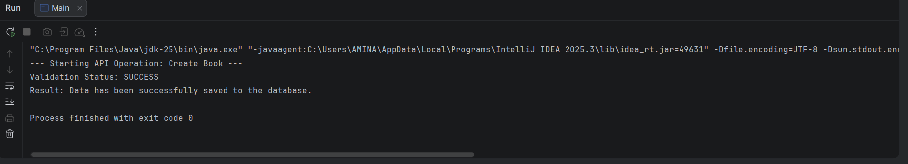
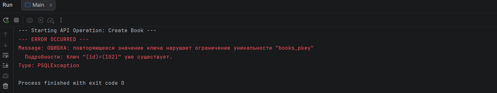
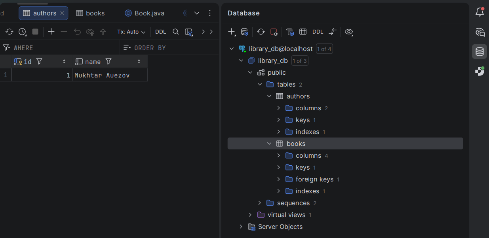

Library Management API (JDBC & OOP Project)
Project Overview
This is a Java-based API designed to manage a library system. The project focuses on the core principles of Object-Oriented Programming (OOP) and integrates a real relational database using JDBC. It follows a multi-layer architecture to ensure clean and maintainable code.

Project Structure (Multi-layer Architecture)
The project is organized into the following packages:

Controller (Main): The entry point of the application that handles user interaction.

Service: Contains business logic and validates data before it reaches the database.

Repository: Manages direct database communication (CRUD operations) using PostgreSQL.

Model: Defines our entities (Book, Author) and their relationships.

Exception: Custom exception classes for handling specific errors.

Utils: Contains the DatabaseConnection class for managing JDBC connections.

Key Features & OOP Implementation
Abstract Class: BaseEntity serves as a parent class for all models, providing common fields like id and name.

Composition: Each Book object contains an Author object, representing a real-world relationship.

Inheritance: Book and Author inherit from BaseEntity.

Interfaces: Implemented Validatable and PricedItem to enforce data validation and price checks.

Polymorphism: Used BaseEntity references to handle different types of entities in a single workflow.

Database Implementation
The project uses PostgreSQL.

JDBC & PreparedStatements: All SQL queries are executed using PreparedStatement to prevent SQL injection and ensure performance.

Schema:

SQL
CREATE TABLE authors (
id INTEGER PRIMARY KEY,
name VARCHAR(255) NOT NULL
);

CREATE TABLE books (
id INTEGER PRIMARY KEY,
name VARCHAR(255) NOT NULL,
author_id INTEGER NOT NULL,
price DECIMAL(10, 2),
FOREIGN KEY (author_id) REFERENCES authors(id)
);
Error Handling
I implemented a custom exception hierarchy to handle various scenarios:

InvalidInputException: Triggered when book data (like name or price) is incorrect.

PSQLException (Duplicate Key): Handled when trying to insert a record with an existing ID.

Reflection
During this project, I learned how to connect a Java application to a PostgreSQL database. 
One of the biggest challenges was correctly mapping the author_id foreign key between tables and ensuring the JDBC driver was properly configured. 
I also realized the importance of the Service layer in preventing invalid data from being saved to the database.

Console output showing successful data validation and database insertion.

Demonstration of custom exception handling when a duplicate primary key is detected.

Visual representation of the PostgreSQL schema including authors and books tables.
